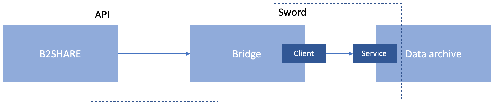
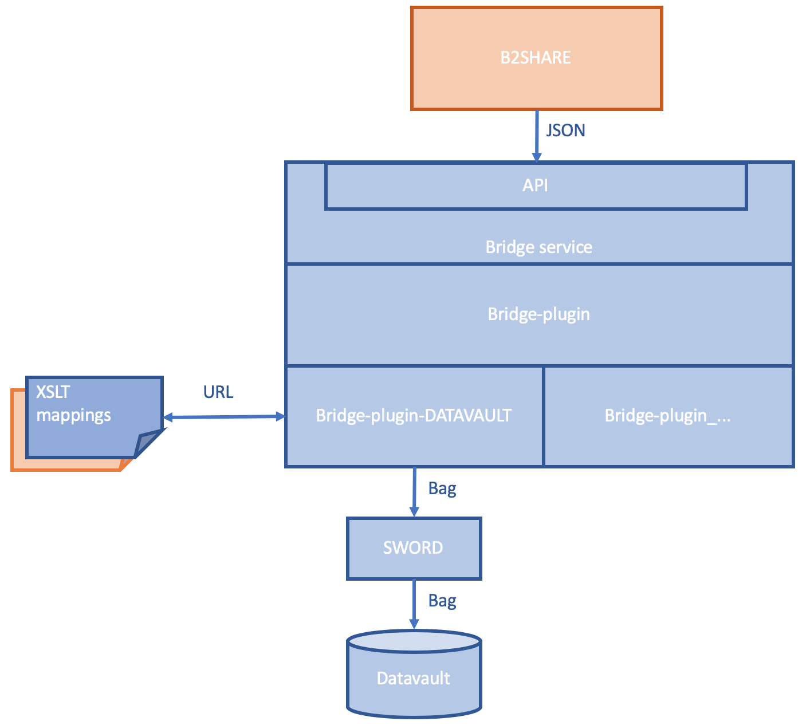
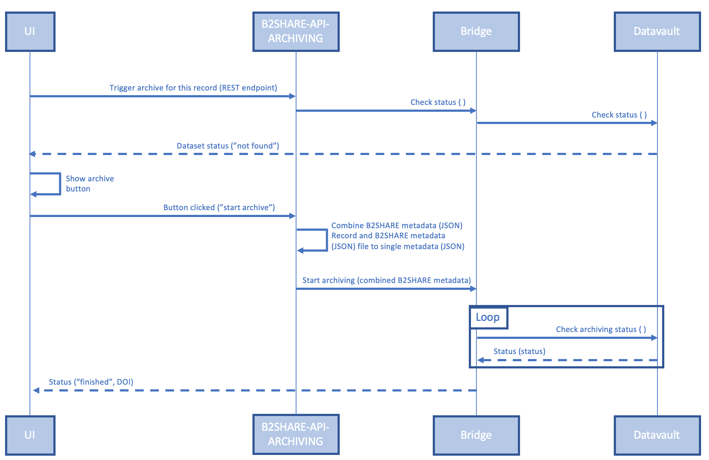
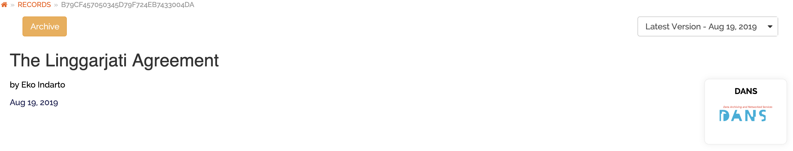
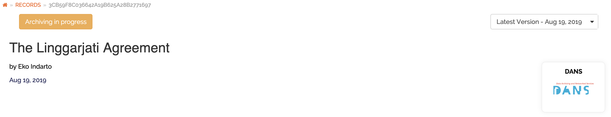
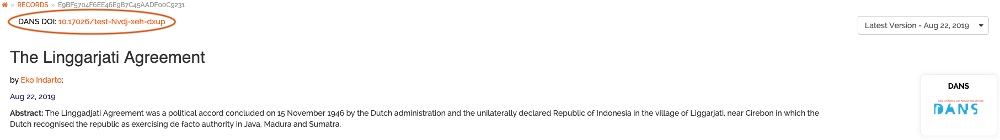
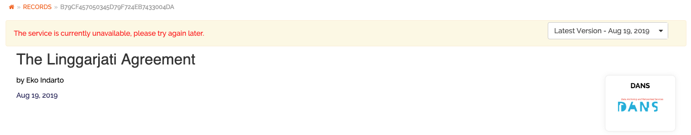

# B2Share to Digital Archiving Repository using Bridge

## Overview
At [DANS](https://dans.knaw.nl) we have developed a [bridge](https://github.com/DANS-KNAW/dataverse-bridge-service) to transfer datasets from a short-term repository to our long-term archive called [Datavault](https://easy.dans.knaw.nl/ui/home). This bridge implements the SWORD protocol (v2.0). The bridge communicates via API with the short-term repository. 
Within [EOSChub](https://www.eosc-hub.eu/) we have developed a [B2SHARE module](#b2share-code) for communication between [B2SHARE](https://b2share.eudat.eu/) and the [Bridge](https://github.com/DANS-KNAW/dataverse-bridge-service). 
The module is developed in a generic way; therefore it can be applied within any B2SHARE community by enabling the archiving function in the [B2SHARE settings](#b2share-setting). 
 
In the sections below more details are provided about:

-	[Architecture](#b2share-Bridge-DAR-architecture)
-	[Sequence Diagram](#b2share-Bridge-DAR-sequence-diagram)
-	[Changes needed in the B2share code](#b2share-code)
-	[Setting up the B2Share](#b2share-setting)

## Architecture

## Sequence Diagram

## Changes needed in the B2Share code

A new module - called [apiarchive](https://github.com/ekoi/b2share-dtap/tree/master/provisioning/roles/add-archive-module/files) - is developed. 
This endpoint API module handles the communication between B2Share and Bridge. 

A new javascript file ([archive.jsx](https://github.com/ekoi/b2share-dtap/blob/master/provisioning/roles/add-archiving/files/archive.jsx)) is created to manage archive and archiving progress buttons. This functionality can be enabled/disabled through [settings](#b2share-setting-buttons).   

The [archive.jsx](https://github.com/ekoi/b2share-dtap/blob/master/provisioning/roles/add-archiving/files/archive.jsx) also manage warning and DANS doi display.

Since an archived dataset at DANS cannot be changed, the Edit Metadata button is hided. However to display/hide the Edit Metadata button is [configurable](#b2share-setting-buttons)

## B2Share Setting

_This part describes how to set up and use development environment for B2Share._

Requirements
------------

It is assumed that you are working in a Mac OS X environment.

* Brew, to install some of the other stuff: see [brew], if you haven't installed it yet.
* [Git](https://github.com/join) (`brew install git`).
* [Vagrant](https://www.vagrantup.com/) (`brew cask install vagrant`)
* [VirtualBox](https://www.virtualbox.org/wiki/Downloads): (Download link or `brew cask install virtualbox`.)
* The vagrant-vbguest plugin for vagrant: (`vagrant plugin install vagrant-vbguest`).
* Ansible (`brew install ansible` or `sudo pip install ansible==2.4.0.0`)
* [DANS-Bridge](https://github.com/DANS-KNAW/dataverse-bridge-service)

 Requirement            | Version
------------------------|------------------------------------------------------------------
Git                     | 2.20.1
Vagrant                 | 2.2.3
Ansible                 | 2.7.5
VirtualBox              | 5.2.22

### Steps

1. Clone this project:

        git clone https://github.com/ekoi/b2share-dtap.git

2. Create a static host name for the local VMs in your `/etc/hosts` file. Make sure
   the following lines are present:

	    192.168.33.11   devb2share.dans.knaw.nl
	
	The IP address on the left is from your `Vagrantfile`.
	    

3. Go to the `b2share-dtap` project directory:
   
              cd b2share-dtap
 
4. Edit the `provisioning/host_vars/devb2share.yml` file
              
              #B2Share Configuration  
              b2access_consumer_key=REPLACE_WITH_YOUR_OWN_KEY
              b2access_secret_key=REPLACE_WITH_YOUR_OWN_SECRET
              
              #Bridge Configuration
              b2share_jsonschemas_host=your-chosen-domain-name:5000
              b2share_jsonschemas_port=bridge-url:port/api/v1
              bridge_ip_address=REPLACE_WITH_YOUR_BRIDGE_IP_ADDRESS
              bridge_port=REPLACE_WITH_YOUR_BRIDGE_PORT
              bridge_apikey=REPLACE_WITH_YOUR_BRIDGE_APIKEY
              
              #Digital Archive Repository Configuration
              bridge_dar_username=REPLACE_WITH_YOUR_DAR_USERNAME
              bridge_dar_password=REPLACE_WITH_YOUR_DAR_PASSWORD
              
              # Hide edit metadata button. Comma sparated communities list.
              communities_hide_editmetadata='DANS'
              
              # Enable archive button. Comma sparated communities list.
              communities_enable_archive='DANS'
              
5. Clone, install and follow instractions of [DANS Bridge](https://github.com/DANS-KNAW/dataverse-bridge-service)    

6. To make a fresh start with the configured `devb2share.yml`:
   
   * `cd b2share-dtap` or wherever it is located on your mac
   * `vagrant destroy`
   * `vagrant up` this may take half an hour
   
 
      	   